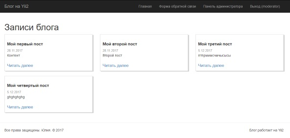
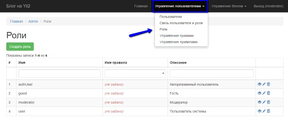
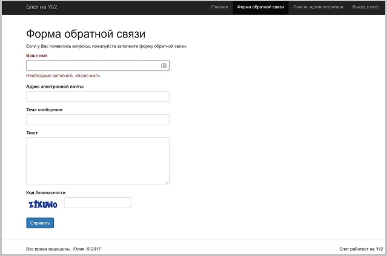

# Блог на Yii2
Универсальный набор инструментов для создания блога, разработанный на базе популярного PHP-фреймворка Yii2 Basic.

Базовая версия включает инструменты для размещения постов, добавления комментариев, тегов, а также вывод постов с определенным тегом.

Система включает блог (front-end) и панель администратора (back-end).
Контроль прав доступа пользователей построен с использованием RBAC (то есть пользователи получают доступ к системе в соответствии с назначенной ролью и заданным набором разрешений).

Добавление, редактирование и удаление ролей доступно для пользователя moderator и осуществляется из административной панели. 




## Системные требования
+ PHP 5.4+

+ СУБД MySQL

## Установка

1. Склонируйте репозиторий или скачайте архив с кодом.

2. Перейдите в корневую директорию проекта.

3. Выполните команду _composer install_ для установки всех зависимостей проекта.

Для установки зависимостей у Вас на ПК должен быть установлен [менеджер зависимостей composer](https://getcomposer.org/download/).

## Настройка параметров подключения к базе данных
Настройки подключения к базе данных находятся в файле config/db.php
Измените их на свои.

```html
return [
    'class' => 'yii\db\Connection',
    'dsn' => 'mysql:host=localhost;dbname=yii2blog',
    'username' => 'yii2blog',
    'password' => 'yii2blog',
    'charset' => 'utf8',
```

## Миграции
Для создания правильной структуры базы данных примените в консоли следующие миграции в строгой последовательности (сверху вниз):

```
yii migrate --migrationPath=@yii/rbac/migrations
```
```
yii migrate --migrationPath=@mdm/admin/migrations
```
```
yii migrate
```
### Панель администратора

Панель администратора состоит из двух основных  разделов: 
Управление пользователями и управление блогом.

За работу панели администратора отвечает модуль _modules/admin_.

Полный доступ к админ панели имеет пользователь с ролью moderator.
## Управление пользователями

В системе предопределены 3 пользователя: admin, user, moderator, с разными правами доступа.
```
Пароль для всех пользователей по умолчанию: 123456
```
1. admin - пользователю добавлена роль user, он может управлять блогом, но не может менять права доступа и распределять роли.

2. user - роль authUser (авторизованный пользователь), он может оставлять только комментарии и просматривать блог.

3. moderator - пользователю по умолчанию добавлена роль модератора, это суперпользователь блога (как root в linux).

В классе m171121_092239_insert_user_and_assignment_string реализована связь пользователей и назначение ролей по умолчанию:
  
```php
protected function getAuthAssignmentData()
    {
        return [
            ['item_name' => 'authUser','user_id' => '2','created_at' => '1511256465'],
            ['item_name' => 'moderator','user_id' => '3','created_at' => '1511256470'],
            ['item_name' => 'user','user_id' => '1','created_at' => '1511256457']
        ];
    }
```
 
### Пользовательские роли и права

В блоге предусмотрено 4 основные роли: гость, авторизованный пользователь, пользователь системы и модератор.

Во вкладке "Роли" устанавливается иерархия ролей, а также назначаются права и правила каждой роли.


 
### Управление правилами

Класс \rbac\rules\PostOwnRule реализует правило _blog_post_own_. Данное правило отвечает за принадлежность поста определенному пользователю:

```php
public function execute($user, $item, $params)
    {

       return (isset($params['model'])) ? $params['model']->fk_user_id === $user : false;
    }
```
 
## Управление блогом

### Управление записями

Возможность создавать посты зависит от наличия разрешения _blog_post_create_, редактировать _blog_post_update_ и удалять посты _blog_post_delete_. 

Пользователи могут редактировать только свои посты, модератор наделен полными правами, которые позволяют ему получить полный доступ к управлению постами.

При создании поста можно добавить теги, которые уже созданы в системе. 
При редактировании поста есть возможность удалить неактуальный тег и добавить новый.
Пост создается от текущего пользователя, однако у модератора есть возможность создать пост от любого пользователя.

### Управление комментариями
 
Возможность создавать комментарии зависит от наличия разрешения _blog_comment_create_.
 
### Управление тегами

Управлять тегами может только пользователь с ролью модератор, у которого есть следующие разрешения:

+ blog_tag_create - создание тега;
+ blog_tag_read - просмотр тега;
+ blog_tag_update - редактирование тега;
+ blog_tag_delete - удаление тега.
 

### Связь многие ко многим

С помощью  таблицы many_post_tag, организована связь "многие ко многим", где у каждого поста может быть несколько тегов, а также у каждого тега может быть несколько постов.

В контроллере _controllers/SiteController_ связь "многие ко многим" применяется для выборки всех постов с необходимым тегом:

```php
public function actionIndex($link = null)
           {
               $query = Post::find();
               if($link !== null){
                   $query = Post::find()->joinwith('fkTags')->where([Tag::tableName() . '.link' => $link]);
                   ...
           }
```

## Форма обратной связи
Для коммуникации пользователей с администратором сайта предусмотрена форма обратной связи.

E-mail администратора указывается в файле _config/params.php_

```php
return [
    'adminEmail' => 'admin@example.com',
...
]
```




